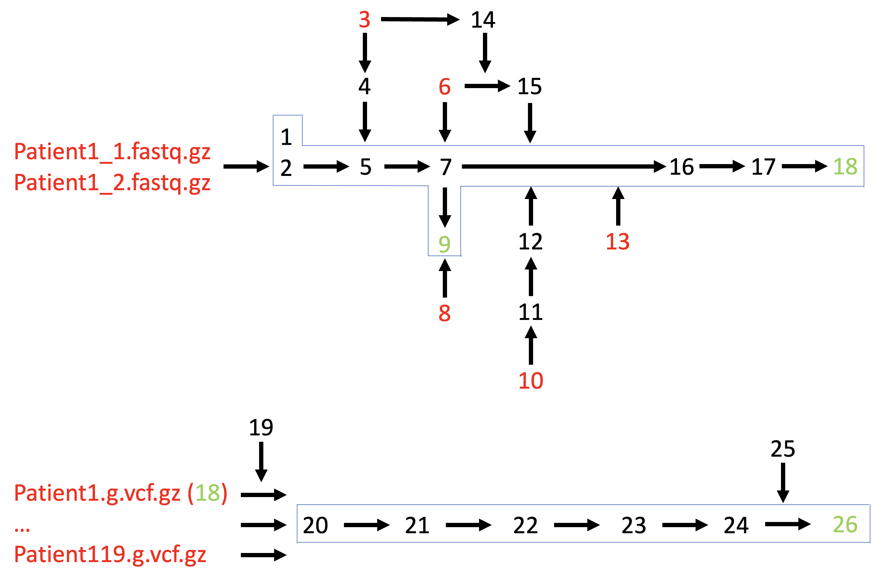

**Конвейер по обработке данных**

> $1 - ID входного файла (например Patient1 из файлов Patient1_1.fastq.gz и Patient1_2.fastq.gz)
> $2 - количество потоков (threads)

1) Проверка качества с помощью FastQC (версия v0.11.5)
```
fastqc -t $2 $1_1.fastq.gz $1_2.fastq.gz
```
2) Фильтрация данных с помощью trimmomatic (версия 0.39)
```
java -jar /opt/Trimmomatic-0.39/trimmomatic-0.39.jar \
 PE \
 -threads $2 \
 -phred33 \
 $1_1.fastq.gz $1_2.fastq.gz \
 $1_R1_paired.fastq.gz $1_R1_unpaired.fastq.gz \
 $1_R2_paired.fastq.gz $1_R2_unpaired.fastq.gz \
 ILLUMINACLIP:/opt/Trimmomatic-0.39/adapters/All_adapters.fa:2:30:10 \
 LEADING:20 \
 TRAILING:20 \
 SLIDINGWINDOW:4:20 \
 MINLEN:50
```
3) Скачивание эталонного генома человека (сборка GATK Homo_sapiens_assembly38.fasta) и словаря последовательности (Homo_sapiens_assembly38.dict) для эталонного генома (требуется 1 раз)
```
wget https://rcs.bu.edu/examples/bioinformatics/gatk/ref/Homo_sapiens_assembly38.dict
wget https://rcs.bu.edu/examples/bioinformatics/gatk/ref/Homo_sapiens_assembly38.fasta
```
4) Индексация генома с помощью bwa-mem2 (версия 2.2.1) (требуется 1 раз)
```
/opt/bwa-mem2-2.2.1_x64-linux/bwa-mem2 index Homo_sapiens_assembly38.fasta
```
5) Выравнивание парных последовательностей на эталонный геном с формированием группы чтения (RG) и последующей сортировкой необходимой для 7 шага.
```
SAMPLE_ID=$1
RG=$"@RG\tID:${SAMPLE_ID}\tSM:${SAMPLE_ID}\tPL:ILLUMINA\tLB:lib1"

/opt/bwa-mem2-2.2.1_x64-linux/bwa-mem2 mem \
 -t $2 \
 -M -Y \
 -R "$RG" \
 ./reference/Homo_sapiens_assembly38.fasta.gz \
 ${SAMPLE_ID}_R1_paired.fastq.gz \
 ${SAMPLE_ID}_R2_paired.fastq.gz | \
 samtools sort -@ $2 -o ./bam/${SAMPLE_ID}.bam -
```
6) Загрузка GATK образа  (требуется 1 раз)
```
docker pull broadinstitute/gatk:4.6.2.0
```
7) Запуск инструмента MarkDuplicates из GATK внутри Docker-контейнера для обнаружения и маркировки ПЦР-дупликатов в BAM-файле.
```
docker run --rm -v $(pwd):/data -w /data broadinstitute/gatk:4.6.2.0 \
 gatk MarkDuplicates \
 -I ./bam/$1.bam \
 -O ./bam/$1.marked.bam \
 -M ./bam/$1.metrics.txt \
 --CREATE_INDEX true
```
8) Скачивание панели Vazyme VAHTS Target Capture Core Exome Panel (https://www.vazymeglobal.com/product-center/capture-probe/vahts-target-capture-core-exome-panel). Внутри архива — 4 файла. Для работы используется файл CoreExomePanel.hg38.p12.target.v3(1).bed. Перед использованием его необходимо один раз переименовать в CoreExomePanel.hg38.p12.target.v3.bed (для шаге 9).

9) Вычисление глубины покрытия без дубликатов. 34128352 - суммарная длина панели
```
samtools depth $1.bam -b CoreExomePanel.hg38.p12.target.v3.bed > $1.bed

depth=30
GENOME_SIZE=34128352

awk -v d=$depth -v g=$GENOME_SIZE '
    $3 >= d { count++ }
    END { printf "%.5f%%\n", (count/g)*100 }
' $1.bed

```
10) Загрузка SNP в VCF-формате (версия от 2025-01-15 21:27, 28 ГБ)
```
wget https://ftp.ncbi.nih.gov/snp/latest_release/VCF/GCF_000001405.40.gz
```
11) Замена RefSeq ID в первом столбце на формат chr (например, NC_000001.11 → chr1). Добавление информации о длине хромосом в заголовок файла (например, ##contig=<ID=chr1,length=248956422>). Итоговое название файла dbsnp157.vcf.gz

12) Запуск инструмента IndexFeatureFile из GATK внутри Docker-контейнера для создания индекса у VCF-файла с SNP-датасетом dbsnp157. Выходной файл - dbsnp157.vcf.gz.tbi
```
docker run --rm -v $(pwd):/data -w /data broadinstitute/gatk:4.6.2.0 \
 gatk IndexFeatureFile -I dbsnp157.vcf.gz
```
13) Загрузка InDels в VCF-формате (версия от 2021-05-04 16:17, 20M и 2021-05-04 16:17, 59M) и индексы файлов. Mills_and_1000G_gold_standard.indels.hg38.vcf.gz — это качественный «золотой стандарт». Используется, когда нужно быть максимально уверенным в валидации. Homo_sapiens_assembly38.known_indels.vcf.gz — это максимально полный справочник. Используется для широкого «маскирования» вариабельных участков.
```
wget https://rcs.bu.edu/examples/bioinformatics/gatk/ref/Mills_and_1000G_gold_standard.indels.hg38.vcf.gz
wget https://rcs.bu.edu/examples/bioinformatics/gatk/ref/Mills_and_1000G_gold_standard.indels.hg38.vcf.gz.tbi

wget https://rcs.bu.edu/examples/bioinformatics/gatk/ref/Homo_sapiens_assembly38.known_indels.vcf.gz
wget https://rcs.bu.edu/examples/bioinformatics/gatk/ref/Homo_sapiens_assembly38.known_indels.vcf.gz.tbi
```
14) Создание индекса fai для генома
```
samtools faidx Homo_sapiens_assembly38.fasta
```
15) Конвертация BED-файла в IntervalList (формат GATK).
```
docker run --rm -v $(pwd):/data -w /data broadinstitute/gatk:4.6.2.0 \
 gatk BedToIntervalList \
 -I CoreExomePanel.hg38.p12.target.v3.bed \
 -O CoreExomePanel.hg38.p12.target.v3.interval_list \
 -R ./reference/Homo_sapiens_assembly38.fasta \
 --SEQUENCE_DICTIONARY ./reference/Homo_sapiens_assembly38.dict \
 --DROP_MISSING_CONTIGS true \
 --SORT true
```
16) Запуск BaseRecalibrator для перекалибровки базовых качеств (Base Quality Score Recalibration, BQSR).
```
docker run --rm -v $(pwd):/data -w /data broadinstitute/gatk:4.6.2.0 \
 gatk BaseRecalibrator \
 -I ./bam/$1.marked.bam \
 -R ./reference/Homo_sapiens_assembly38.fasta \
 --known-sites dbsnp157.vcf.gz \
 --known-sites Homo_sapiens_assembly38.known_indels.vcf.gz \
 --known-sites Mills_and_1000G_gold_standard.indels.hg38.vcf.gz \
 -L CoreExomePanel.hg38.p12.target.v3.interval_list \
 --interval-padding 100 \
 -O ./bam/$1.recal.table
```
17) Запуск ApplyBQSR применяет таблицу перекалибровки качеств (созданную на предыдущем шаге $1.recal.table) к BAM файлу (созданный на шаге 9 на$1.marked.bam), исправляя оценки качества каждого основания.
```
docker run --rm -v $(pwd):/data -w /data broadinstitute/gatk:4.6.2.0 \
 gatk ApplyBQSR \
 -I ./bam/$1.marked.bam \
 -R ./reference/Homo_sapiens_assembly38.fasta \
 --bqsr-recal-file ./bam/$1.recal.table \
 --create-output-bam-index true \
 --add-output-sam-program-record true \
 -O ./bam/$1.recal.bam
```
18) Запуск HaplotypeCaller. Индивидуальный Variant Calling (GATK)
```
docker run --rm -v $(pwd):/data -w /data broadinstitute/gatk:4.6.2.0 \
 gatk HaplotypeCaller \
 -R ./reference/Homo_sapiens_assembly38.fasta \
 -I ./bam/$1.recal.bam \
 -O ./gvcf/$1.g.vcf.gz \
 -L CoreExomePanel.hg38.p12.target.v3.interval_list \
 -ERC GVCF
```
19) Когортный анализ. Создание карты образцов.
```
Patient1 ./gvcf/barcode1.g.vcf.gz
Patient2 ./gvcf/barcode2.g.vcf.gz
...
Patient126 ./gvcf/barcode126.g.vcf.gz
```
20) Когортный анализ. Запуск GenomicsDBImport для создание базы данных. Ниже пример для хромосомы 1 (повторить для всех хромосом chr1-22, X, Y).
```
docker run --rm -v $(pwd):/data -w /data broadinstitute/gatk:4.6.2.0 \
 gatk GenomicsDBImport \
 --genomicsdb-workspace-path ./genomicsdb/chr1_db \
 -R ./reference/Homo_sapiens_assembly38.fasta \
 --sample-name-map ./sample_map.txt \
 -L chr1
```


